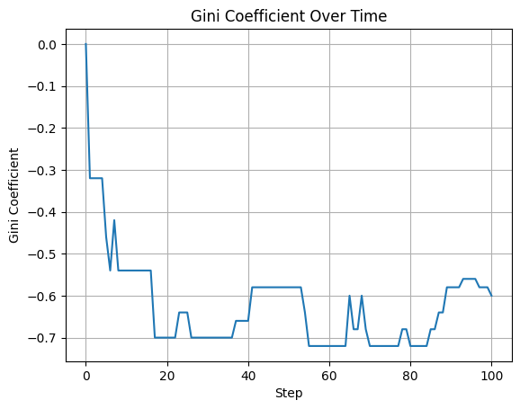
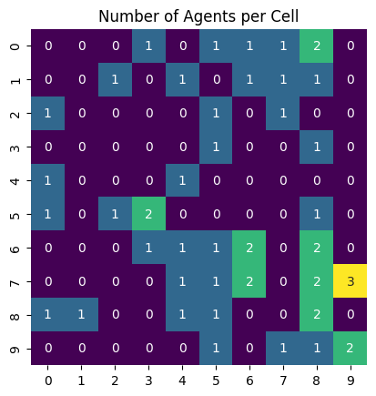
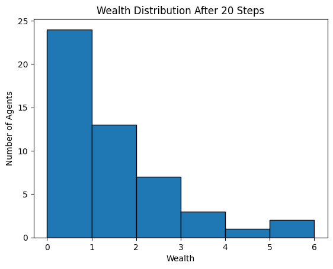
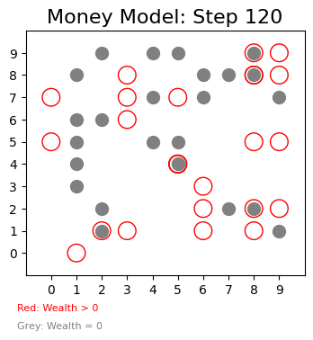

# Multi-Agent Stochastic Modeling of Resource Distribution Equilibrium

## 📌 Project Overview
This research project implements a decentralized **Multi-Agent System (MAS)** to simulate emergent economic behavior and resource allocation equilibrium. The core objective is to analyze how individual stochastic interactions and local movement rules (Moore neighborhood) lead to macro-level structural inequality.

The model is evaluated using the **Gini Coefficient** as a key objective function, providing insights into system-level stability and convergence rates across varying population scales.

### 🛠 Built with Mesa
[Mesa](https://github.com/projectmesa/mesa) is an Apache2 licensed agent-based modeling (or ABM) framework in Python.

---

## 🔬 Mathematical Framework
The model tracks the evolution of inequality through the **Gini Coefficient ($G$)**. For a population of $n$ agents with wealth $x_i$, where $x$ is indexed in non-decreasing order ($x_i \leq x_{i+1}$):

$$G = 1 + \frac{1}{n} - \frac{2}{n^2 \bar{x}} \sum_{i=1}^n (n-i+1) x_i$$

Where:
*   **Stochastic Rule:** Agents move randomly to adjacent cells and transfer a fixed resource unit upon interaction.
*   **Decentralized Nature:** No central controller; equilibrium emerges solely from local peer-to-peer interactions.

---

## 📊 Research Results & Analysis

### 1. Sensitivity Analysis (Population Scaling)
We conducted multi-parameter batch runs to observe how agent density ($N=10$ to $N=50$) affects the rate of convergence and the final steady state of inequality.

| Population Sensitivity | Convergence Comparison |
| :---: | :---: |
|  |  |

### 2. Temporal Evolution
Analysis of the Gini Coefficient over a 100-step horizon indicates a clear trajectory toward system stabilization, confirming that stochastic local rules produce predictable macro-level outcomes.

### 3. Spatial Distribution & Clustering Patterns
Heatmap analysis reveals the density of agents across the 2D grid environment. This visualizes the stochastic spatial patterns and "clustering" that occur as agents navigate the decentralized environment.

| Final Spatial Density | Stochastic Clustering |
| :---: | :---: |
|  |  |

### 4. Statistical Resource Distribution
The following histograms compare the probability density of resources in the early stage ($T=20$) versus the steady state ($T=100$), illustrating the movement toward a Pareto-like distribution.

| Early Stage Distribution (T=20) | Steady State Distribution (T=100) |
| :---: | :---: |
|  |  |

### 5. Micro-state Visualization
A detailed snapshot of the simulation environment where **Red Circles** represent prosperous agents (Wealth > 0) and **Grey Markers** indicate agents in a transient state of resource depletion (Wealth = 0).

---

## 🚀 Getting Started

### 🚀 Installation

1. **Clone the repository:**
   bash
   git clone https://github.com/YOUR_GITHUB_USERNAME/Multi-Agent-Stochastic-Modeling.git
pip install -r requirements.txt
python main.py

📜 License
Distributed under the Apache License 2.0. See the LICENSE file for more information.

🤝 Contact
Yahiaoui Raiane – Telecommunications Systems Engineer

📧 Email: ikba.king2015@gmail.com
